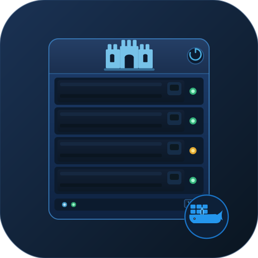

# synology-borg-server

<p align="center"></p>

Language: 🇬🇧 English | [🇩🇪 Deutsch](README.de.md)

Lightweight BorgBackup server running in Docker with SSH key-based authentication and per-client path restrictions.

## Motivation
Synology DSM does not allow interactive shell login for non-admin users, and those users cannot use the package-installed Borg as a Borg server. This container helps provide a dedicated Borg server on a Synology NAS.

> **Note:** This container is not limited to Synology NAS. It can be used on any NAS (e.g., UGREEN, QNAP, TerraMaster) or Linux server that supports Docker Engine. See the [Compatibility](#compatibility) section for details.

## What this project does

- Runs `sshd` and `borgbackup` in an Alpine-based container.
- Creates a dedicated backup user from environment variables (`BORG_USER`, `BORG_UID`, `BORG_GID`).
- Loads authorized client public keys from a mounted `authorized_keys` file.
- Persists SSH host keys to keep the SSH fingerprint stable.
- Stores all Borg repositories under `/var/backup/borg` (mounted to your NAS storage).

## Advantages of this Project
Running the Borg server in a Docker container with non-admin user support and restrict paths protection offers several advantages:

1. **Enhanced Security:**
   - The container runs as a non-root (non-admin) user, reducing the risk of privilege escalation and limiting the impact of potential vulnerabilities.
   - SSH key authentication and the restrict option in authorized_keys ensure clients can only access their assigned backup repositories, preventing unauthorized access to other data.

2. **Isolation:**
   - Docker containers isolate the Borg server from the host system and other services, minimizing the risk of interference or accidental data exposure.

3. **Portability:**
   - The solution works on any NAS or server with Docker support (Synology, QNAP, UGREEN, TerraMaster, etc.), making it easy to deploy and migrate.

4. **Easy Updates and Maintenance:**
   - Updates to Borg or its dependencies can be managed by rebuilding or updating the container, without affecting the host system.

5. **Simplified Permissions:**
   - No need to grant admin/root access to backup users. Each client operates with minimal privileges, only within their designated repository.

6. **Consistent Environment:**
   - The container ensures a consistent runtime environment (Alpine Linux, specific Borg version), reducing compatibility issues across different NAS platforms.

7. **Fine-grained Access Control:**
   - The restrict option in SSH authorized_keys enforces strict path access, so each client can only read/write to their own backup directory, even if they try to access other paths.

8. **Easy Rollback and Recovery:**
   - If something goes wrong, you can easily revert to a previous container image or configuration without affecting the host system.

This approach combines security, flexibility, and ease of use, making it ideal for multi-user backup scenarios on shared NAS devices.

## About Alpine Linux

This project uses Alpine Linux as the base image for the container. Alpine Linux is a lightweight, security-focused Linux distribution designed for simplicity and efficiency. It is widely used in Docker environments because:

- The base image is extremely small (under 6MB), which speeds up builds and reduces attack surface.
- Alpine uses musl libc and busybox for minimalism and performance.
- Package management is handled by `apk`, which is fast and easy to use.
- Designed for running applications in containers, microservices, and cloud environments.
- Security features: minimal privileges, hardened kernel options, reproducible builds.

How it works in Docker:
- The official Alpine image provides a minimal root filesystem.
- You install only the packages you need (e.g., `openssh-server`, `borgbackup`, `tzdata`) using `apk add`.
- The container starts quickly, uses little memory, and is easy to keep up-to-date.

Alpine is ideal for scenarios where you want a secure, fast, and minimal environment for your application.

> **Current version:** This project currently uses `alpine:3.23`. See `context/Dockerfile` to check or update the version. Available releases: [hub.docker.com/_/alpine](https://hub.docker.com/_/alpine/tags)
>
> **BorgBackup package on Alpine 3.23:** This project currently uses `borgbackup` version `1.4.3-r0` from Alpine `v3.23`. Package reference: [pkgs.alpinelinux.org (borgbackup, v3.23)](https://pkgs.alpinelinux.org/packages?name=borgbackup&branch=v3.23&repo=&arch=&origin=&flagged=&maintainer=)

## Repository structure

```
synology-borg-server/
├── docker-compose.yml                 – service configuration and host volume mounts.
├── .env.example                       – single-environment template.
├── .env.prod.example                  – production template.
├── .env.test.example                  – test template.
├── authorized_keys.example            – template with restricted key entries.
├── context/
│   ├── Dockerfile                     – container image definition.
│   └── docker-entrypoint.sh           – runtime user + sshd setup.
├── README.md                          – this file (English).
├── README.de.md                       – German version.
└── LICENSE                            – project license.
```

## Prerequisites

- Docker Engine with Compose support (`docker compose ...`).
- Host directories for:
  - SSH host keys
  - `authorized_keys` file
  - Borg repositories
- A dedicated non-admin user on your NAS/server.

## Compatibility

This project is **not limited to Synology NAS**. It can be used on any Linux system that meets the prerequisites in this README and provides Docker Engine with Compose support.

This container works on **any Synology NAS model that supports Docker** (Container Manager), regardless of CPU architecture. Because the image is built directly on the NAS at runtime (`docker compose up --build`), Docker automatically uses the host's native architecture — `x86_64`, `aarch64`, or `armv7`.

The Alpine base image and its packages (`openssh`, `borgbackup`) are available for all these architectures, so no pre-built image or cross-compilation is needed.

> **Note:** Docker (Container Manager) itself requires a minimum DSM version and a supported model. If Docker runs on your NAS, this container will work.

## NAS Directory Layout

Based on the environment variables in `.env` (or `.env.prod`/`.env.test`), your Synology NAS will have a structure like this:

```
/volume1/borg-backups/                         # or borg-backups-prod, borg-backups-test, etc.
├── config/
│   ├── ssh/                                   # SSH_CONFIG_DIR — persistent SSH host keys
│   │   ├── ssh_host_rsa_key
│   │   ├── ssh_host_rsa_key.pub
│   │   ├── ssh_host_ed25519_key
│   │   └── ssh_host_ed25519_key.pub
│   └── authorized_keys                        # AUTHORIZED_KEYS_FILE — client public keys
└── repos/                                     # BORG_REPOS_DIR — all Borg repositories
    ├── client-host-1/                         # Repository for client-host-1
    ├── client-host-2/                         # Repository for client-host-2
    └── .../
```

**Key points:**
- Each directory and file is owned by the backup user (defined by `BORG_UID:BORG_GID`).
- Permissions are set to restrict access (750 for dirs, 600 for `authorized_keys`).
- SSH host keys are persisted so the fingerprint stays stable across container restarts.
- Each client repository is isolated and access-controlled via `authorized_keys`.


## Start and Stop

How to set up, start, and stop the BorgBackup server. Choose the approach that fits your setup.

### First-time Setup (Single Environment)

Follow these steps to prepare your environment before starting the server for the first time:

1. Copy environment template:

   ```bash
   cp .env.example .env
   ```

2. Adjust `.env` values:
   - `TZ`
   - `SSH_HOST_PORT`
   - `SSH_LOG_LEVEL` (`VERBOSE` default, `DEBUG2`/`DEBUG3` for deeper troubleshooting)
   - `SSH_CONFIG_DIR`
   - `AUTHORIZED_KEYS_FILE`
   - `BORG_REPOS_DIR`
   - `BORG_USER`, `BORG_UID`, `BORG_GID`

3. Create host paths and permissions:

   Expected NAS layout (example):

   ```text
   /volume1/
   └── borg-backups/                              # NAS share (or borg-backups-prod / borg-backups-test)
       ├── config/
       │   ├── authorized_keys                    # create this file manually
       │   └── ssh/                               # create this directory manually
       │       ├── ssh_host_rsa_key               # created by container on first start (if missing)
       │       ├── ssh_host_rsa_key.pub           # created by container on first start (if missing)
       │       ├── ssh_host_ecdsa_key             # created by container on first start (if missing)
       │       ├── ssh_host_ecdsa_key.pub         # created by container on first start (if missing)
       │       ├── ssh_host_ed25519_key           # created by container on first start (if missing)
       │       └── ssh_host_ed25519_key.pub       # created by container on first start (if missing)
       └── repos/                                 # Borg repositories (client-host-a, client-host-b, ...)
   ```

   Note: persistent SSH host keys inside `config/ssh` are generated automatically by the container during startup when they do not exist yet.

   Option A (CLI example, Synology SSH shell):

   ```bash
   SHARE_ROOT=/volume1/borg-backups

   mkdir -p "$SHARE_ROOT/config/ssh"
   mkdir -p "$SHARE_ROOT/repos"
   touch "$SHARE_ROOT/config/authorized_keys"

   chown -R <BORG_UID>:<BORG_GID> "$SHARE_ROOT/repos"
   chown <BORG_UID>:<BORG_GID> "$SHARE_ROOT/config/authorized_keys"

   chmod 750 "$SHARE_ROOT/repos"
   chmod 600 "$SHARE_ROOT/config/authorized_keys"
   ```

   Option B (Synology DSM 7 UI example):
   - Open **Control Panel > Shared Folder** and create a shared folder, e.g. `borg-backups`.
   - Open **File Station** and create `config` and `repos` inside that share.
   - Inside `config`, create folder `ssh` and file `authorized_keys`.
   - Set permissions so your backup user (UID/GID from `.env`) can read/write `repos` and `authorized_keys`.
   - Do not create host key files manually; the container creates them in `config/ssh` at first startup.

4. Edit `authorized_keys` on the host:
   - Use `authorized_keys.example` as reference.
   - Add one line per client key with `--restrict-to-path`.

---

### Single-Environment Approach

This approach is best suited for simple setups, home use, or when you only need a single BorgBackup server instance. All configuration, keys, and repositories are managed together. Use this if you do not need strict separation between production and test environments.

Start (build and run):

```bash
docker compose up -d --build
```

Check logs:

```bash
docker compose logs -f --timestamps sshd
```

Stop:

```bash
docker compose down
```


### Recommended: Isolated Prod + Test Stacks

This approach is ideal for advanced setups, production environments, or when you want to keep production and test data, SSH keys, and logs strictly separated. By using separate environment files and Compose project names, you can run multiple independent BorgBackup server instances on the same host without risk of accidental data or key overlap. This setup is highly recommended for anyone managing both live and test backups, or for teams with different operational needs.

Use two independent environment files and different Compose project names for strong separation.

1. Create local environment files:

   ```bash
   cp .env.prod.example .env.prod
   cp .env.test.example .env.test
   ```

2. Adjust values in each file:
   - Different `SSH_HOST_PORT` (e.g., prod `2222`, test `2223`)
   - Different host paths (e.g., `/volume1/borg-backups-prod/...` vs `/volume1/borg-backups-test/...`)
   - Different users/UIDs if possible (`borgprod` / `borgtest`)

3. Start both stacks:

   ```bash
   docker compose --env-file .env.prod -p borg-prod up -d --build
   docker compose --env-file .env.test -p borg-test up -d --build
   ```

4. Follow logs:

   ```bash
   docker compose --env-file .env.prod -p borg-prod logs -f --timestamps sshd
   docker compose --env-file .env.test -p borg-test logs -f --timestamps sshd
   ```

5. Stop stacks:

   ```bash
   docker compose --env-file .env.prod -p borg-prod down
   docker compose --env-file .env.test -p borg-test down
   ```

This gives strong separation for keys, repos, host fingerprints, and operational changes.

### Image Behavior Across Prod/Test Stacks

By default, the image *name* is the same (`synology-borg-server:local`), but the image *ID* (digest) can differ between prod and test.

Why this happens:
- Running `up --build` separately for prod and test performs two separate builds.
- Each build can create a new image ID.
- Existing containers keep the exact image digest they were created with.

Default workflow (can produce different image IDs):

```bash
docker compose --env-file .env.prod -p borg-prod up -d --build
docker compose --env-file .env.test -p borg-test up -d --build
```

Example `docker ps -a` output (different behavior by default):

```text
CONTAINER ID   IMAGE                       PORTS                           NAMES
ec18ea89fb05   ef11a86a2243                0.0.0.0:2222->22/tcp            borg-prod-sshd-1
39d1db502e93   synology-borg-server:local  0.0.0.0:2223->22/tcp            borg-test-sshd-1
```

If you want both stacks to use the exact same image digest, build once and recreate both containers without rebuilding:

```bash
# 1) Build once
docker compose --env-file .env.prod -p borg-prod build sshd

# 2) Recreate both stacks from that same built image
docker compose --env-file .env.prod -p borg-prod up -d --force-recreate --no-build
docker compose --env-file .env.test -p borg-test up -d --force-recreate --no-build
```

Example `docker ps -a` output (same behavior for both stacks):

```text
CONTAINER ID   IMAGE                       PORTS                           NAMES
aa11bb22cc33   synology-borg-server:local  0.0.0.0:2222->22/tcp            borg-prod-sshd-1
dd44ee55ff66   synology-borg-server:local  0.0.0.0:2223->22/tcp            borg-test-sshd-1
```

To verify digests directly:

```bash
docker inspect -f '{{.Name}} -> {{.Image}}' borg-prod-sshd-1 borg-test-sshd-1
```

> **Troubleshooting:** `docker ps -a` may still show a short image ID instead of `synology-borg-server:local` if that image digest currently has no local tag attached. In that case, rely on the digest check above as the source of truth.

## How clients connect

Once the Borg server is installed and configured, it can receive backup jobs from any client using SSH key authentication and the Borg protocol over an `rsh` (remote shell) connection. Clients can be any system with BorgBackup installed and network access to the server's SSH port.

```
   ┌──────────────────────────┐             ┌────────────────────────────────────────────┐
   │      Client Host A       │             │          NAS / Linux Server                │
   ├──────────────────────────┤             │                                            │
   │  $ borg create / prune   │             │  ┌──────────────────────────────────────┐  │
   │  BORG_RSH=               │             │  │         Docker Container             │  │
   │   "ssh -p 2222           ├─SSH:2222───►│  │  sshd [:22]     borgbackup           │  │
   │    -i ~/.ssh/key_a"      │             │  │                                      │  │
   └──────────────────────────┘             │  │  authorized_keys                     │  │
                                            │  │  └─► borg serve --restrict-to-path   │  │
   ┌──────────────────────────┐             │  │                                      │  │
   │      Client Host B       │             │  │  /var/backup/borg/                   │  │
   │                          │             │  │  ├── client-host-a/ (repo A)         │  │
   │  $ borg create / prune   ├─SSH:2222───►│  │  └── client-host-b/ (repo B)         │  │
   │  BORG_RSH=               │             │  └──────────────────┬───────────────────┘  │
   │   "ssh -p 2222           │             │                     │ Volume-Mount         │
   │    -i ~/.ssh/key_b"      │             │  ┌──────────────────▼───────────────────┐  │
   └──────────────────────────┘             │  │              NAS Storage             │  │
                                            │  │  /volume1/borg-backups/repos/        │  │
                                            │  │  ├── client-host-a/ (repo A)         │  │
                                            │  │  └── client-host-b/ (repo B)         │  │
                                            │  └──────────────────────────────────────┘  │
                                            └────────────────────────────────────────────┘
```

**How it works:**
- The client runs Borg commands (e.g., `borg create`, `borg extract`) with `BORG_RSH` set to use SSH and the correct key.
- The server authenticates the client via SSH key and restricts access to the assigned repository path.
- All data is transferred securely over SSH and stored on the specified volume mount.

### Complete workflow (first client setup)

1. Create an SSH key pair on the client (recommended type: `ed25519`):

   ```bash
   ssh-keygen -t ed25519 -f ~/.ssh/borg_client_ed25519 -C "client-host-a-key"
   ```

2. Export the public key:

   ```bash
   cat ~/.ssh/borg_client_ed25519.pub
   ```

3. Insert the public key into the server's `authorized_keys` with path restriction:

   ```text
   command="borg serve --restrict-to-path /var/backup/borg/client-host-a",restrict ssh-ed25519 AAAA...your-public-key... client-host-a-key
   ```

4. Reload the container so changes are loaded.
   Note: whenever `authorized_keys` is modified, restart or recreate the container. A rebuild is not required.

   ```bash
   docker compose up -d --build
   # or
   docker compose restart sshd
   ```

5. Initialize the repository from the client:

   ```bash
   export BORG_RSH='ssh -p <SSH_PORT> -i ~/.ssh/borg_client_ed25519 -o IdentitiesOnly=yes'
   borg init --encryption=repokey-blake2 ssh://<BORG_USER>@<BACKUP_SERVER_HOST>/var/backup/borg/client-host-a
   ```

6. Create the first backup:

   ```bash
   borg create --stats ssh://<BORG_USER>@<BACKUP_SERVER_HOST>/var/backup/borg/client-host-a::first-backup-$(date +%Y-%m-%d) /path/to/data
   ```

7. Verify repository information:

   ```bash
   borg info ssh://<BORG_USER>@<BACKUP_SERVER_HOST>/var/backup/borg/client-host-a
   ```

8. List available archives in the repository:

   ```bash
   borg list ssh://<BORG_USER>@<BACKUP_SERVER_HOST>/var/backup/borg/client-host-a
   ```

9. List the content of the created archive:

   ```bash
   borg list ssh://<BORG_USER>@<BACKUP_SERVER_HOST>/var/backup/borg/client-host-a::first-backup-<DATE>
   ```

---

## Client repository URL examples

Recommended: keep repository URL without explicit port and define SSH details via `BORG_RSH`.
Define `BORG_RSH` in your client environment to specify the SSH command with the correct port and identity file. This keeps your Borg commands clean and consistent.
Export the `BORG_RSH` variable in your shell configuration or before running Borg commands, and use the standard SSH URL format for repositories. The server will handle the connection based on the provided SSH options.

Example of setting `BORG_RSH` and initializing a repository:

**Bash/Zsh:**
```bash
export BORG_RSH='ssh -p <SSH_PORT> -i ~/.ssh/<IDENTITY_FILE> -o IdentitiesOnly=yes'
# Example: initialize a new repository
borg init --encryption=repokey-blake2 ssh://<BORG_USER>@<BACKUP_SERVER_HOST>/var/backup/borg/<YOUR_REPO_NAME>
```

**PowerShell:**

```powershell
$env:BORG_RSH = 'ssh -p <SSH_PORT> -i ~/.ssh/<IDENTITY_FILE> -o IdentitiesOnly=yes'
```

Example repository URLs:

- `ssh://<BORG_USER>@<BACKUP_SERVER_HOST>/var/backup/borg/client-host-1`
- `ssh://<BORG_USER>@<BACKUP_SERVER_HOST>/var/backup/borg/client-host-2`

## Examples
### Logging

Increase SSH verbosity by setting `SSH_LOG_LEVEL` in your environment file. Use `VERBOSE` for normal operation and `DEBUG2`/`DEBUG3` for detailed troubleshooting.

<details>
<summary>Initial container startup logs</summary>

This example shows the first log entries after the container has been built and started up, indicating that the SSH server is listening for connections.

```
synology-borg-server-sshd-1  | Server listening on 0.0.0.0 port 22.
synology-borg-server-sshd-1  | Server listening on :: port 22.
```

</details>

<details>
<summary>Successful authentication and backup session logs</summary>

This example shows log output from the container after a client host connects, authenticates, and initiates a backup. It demonstrates SSH key authentication and the `borg serve` command being executed for the client.

```
synology-borg-server-sshd-1  | Connection from 192.168.0.1 port 37771 on 192.168.0.2 port 22 rdomain ""
synology-borg-server-sshd-1  | Accepted key ED25519 SHA256:**************************************** found at /home/borg/.ssh/authorized_keys:1
synology-borg-server-sshd-1  | Postponed publickey for borg from 192.168.0.1 port 37771 ssh2 [preauth]
synology-borg-server-sshd-1  | Accepted key ED25519 SHA256:**************************************** found at /home/borg/.ssh/authorized_keys:1
synology-borg-server-sshd-1  | Accepted publickey for borg from 192.168.0.1 port 37771 ssh2: ED25519 SHA256:****************************************
synology-borg-server-sshd-1  | User child is on pid 71
synology-borg-server-sshd-1  | Starting session: forced-command (key-option) 'borg serve --restrict-to-path /var/backup/borg/client-host-1' for borg from 192.168.0.1 port 37771 id 0
synology-borg-server-sshd-1  | Received disconnect from 192.168.0.1 port 37771:11: disconnected by user
synology-borg-server-sshd-1  | Disconnected from user borg 192.168.0.1 port 37771

synology-borg-server-sshd-1  | Connection from 192.168.0.1 port 37783 on 192.168.0.2 port 22 rdomain ""
synology-borg-server-sshd-1  | Accepted key ED25519 SHA256:**************************************** found at /home/borg/.ssh/authorized_keys:2
synology-borg-server-sshd-1  | Postponed publickey for borg from 192.168.0.1 port 37783 ssh2 [preauth]
synology-borg-server-sshd-1  | Accepted key ED25519 SHA256:**************************************** found at /home/borg/.ssh/authorized_keys:2
synology-borg-server-sshd-1  | Accepted publickey for borg from 192.168.0.1 port 37783 ssh2: ED25519 SHA256:****************************************
synology-borg-server-sshd-1  | User child is on pid 76
synology-borg-server-sshd-1  | Starting session: forced-command (key-option) 'borg serve --restrict-to-path /var/backup/borg/client-host-2' for borg from 192.168.0.1 port 37783 id 0
synology-borg-server-sshd-1  | Received disconnect from 192.168.0.1 port 37783:11: disconnected by user
synology-borg-server-sshd-1  | Disconnected from user borg 192.168.0.1 port 37783
```

</details>

## Notes

- SSH password login is disabled; only public-key authentication is allowed.
- Keep SSH host-key directories persistent to avoid fingerprint changes.
- `sshd` runs as root inside the container by design.
- Runtime hardening is enabled (`no-new-privileges`, dropped capabilities with minimal allowlist, `tmpfs` for `/run` and `/tmp`).
- `.env`, `.env.prod`, and `.env.test` should remain local and untracked.
